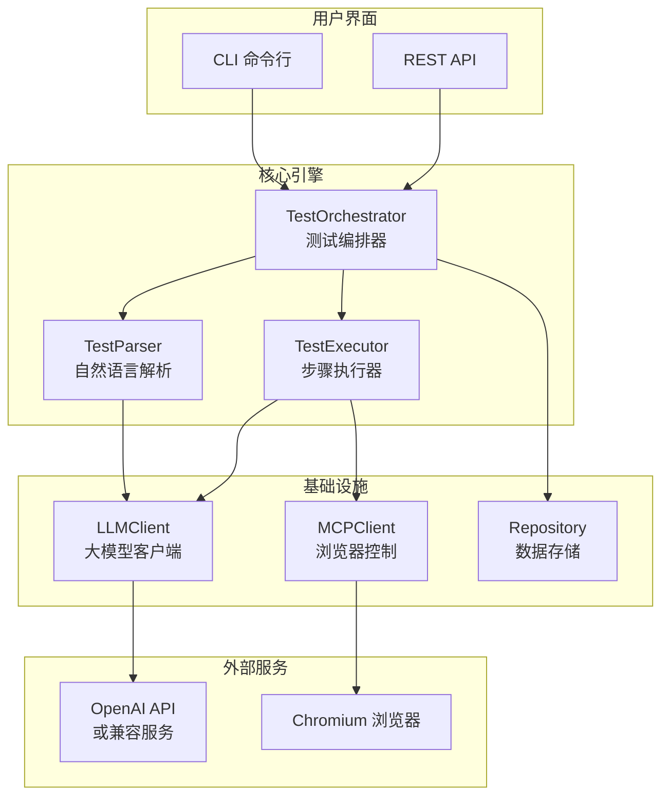
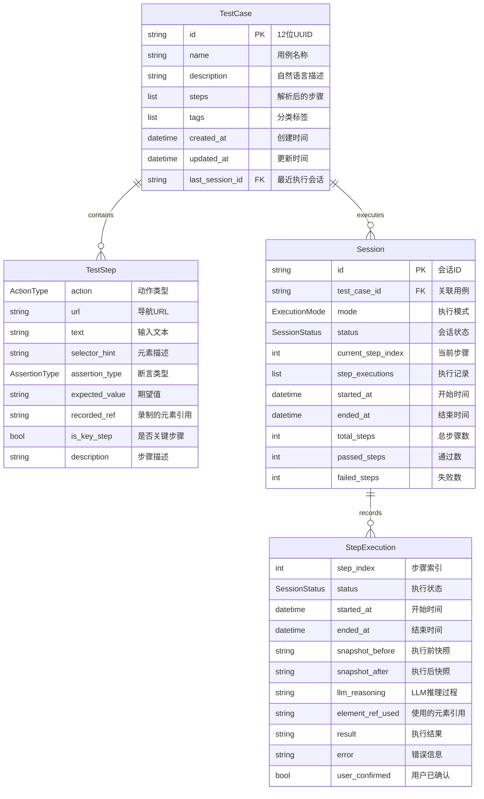
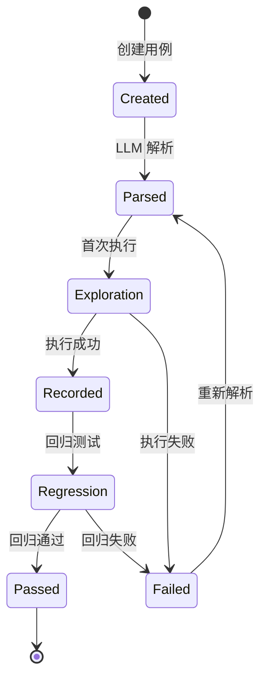
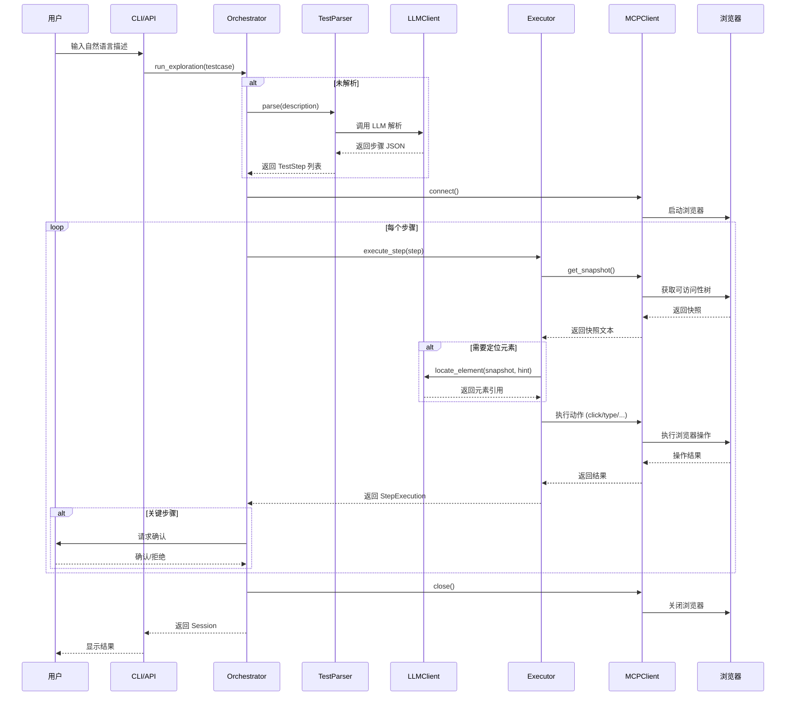
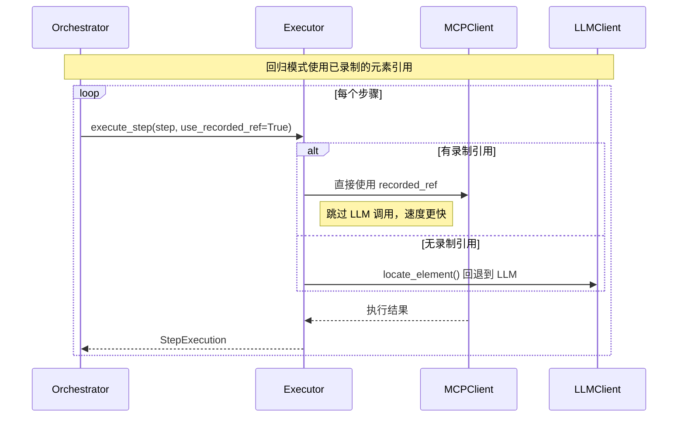
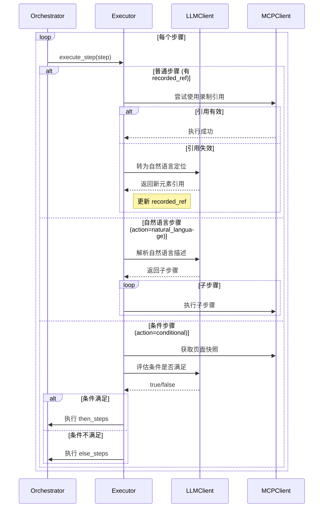
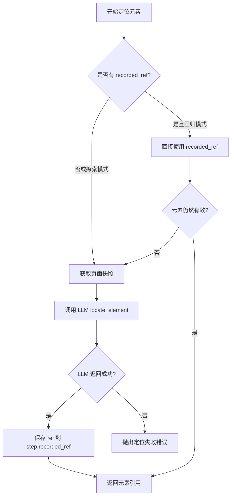

# PlaywrightsPen 项目设计方案

> 剧作家之笔 - 自然语言驱动的自动化测试服务

## 1. 项目概述

### 1.1 项目定位

PlaywrightsPen 是一个将**自然语言测试描述**转换为**可执行浏览器自动化测试**的智能测试服务。它利用 LLM（大语言模型）解析用户的自然语言输入，并通过 Playwright MCP 协议控制浏览器执行测试。

### 1.2 核心价值

| 特性 | 传统自动化测试 | PlaywrightsPen |
|------|---------------|----------------|
| 学习成本 | 需要学习编程和测试框架 | 使用自然语言描述即可 |
| 维护成本 | 元素定位符变化需手动更新 | LLM 智能识别元素 |
| 可读性 | 代码可读性依赖开发者 | 自然语言天然可读 |
| 执行模式 | 单一执行模式 | 支持探索/回归双模式 |

### 1.3 技术栈

```
┌─────────────────────────────────────────────────────────────┐
│                      用户界面层                              │
│  ┌──────────────┐  ┌──────────────┐  ┌──────────────┐      │
│  │   CLI 命令行  │  │  REST API    │  │  (未来 Web)   │      │
│  └──────────────┘  └──────────────┘  └──────────────┘      │
├─────────────────────────────────────────────────────────────┤
│                      核心业务层                              │
│  ┌──────────────┐  ┌──────────────┐  ┌──────────────┐      │
│  │ Orchestrator │  │   Executor   │  │    Parser    │      │
│  │  (流程编排)   │  │  (步骤执行)   │  │  (自然语言)   │      │
│  └──────────────┘  └──────────────┘  └──────────────┘      │
├─────────────────────────────────────────────────────────────┤
│                      基础设施层                              │
│  ┌──────────────┐  ┌──────────────┐  ┌──────────────┐      │
│  │  LLM Client  │  │  MCP Client  │  │  Repository  │      │
│  │ (OpenAI API) │  │ (Playwright) │  │  (文件存储)   │      │
│  └──────────────┘  └──────────────┘  └──────────────┘      │
└─────────────────────────────────────────────────────────────┘
```

---

## 2. 系统架构

### 2.1 模块结构

```
src/playwrights_pen/
├── __init__.py          # 包初始化
├── main.py              # FastAPI 应用入口
├── cli.py               # Typer CLI 入口
├── config.py            # 配置管理
├── api/                 # REST API 层
│   ├── testcases.py     # 测试用例 API
│   └── sessions.py      # 执行会话 API
├── core/                # 核心业务逻辑
│   ├── orchestrator.py  # 测试编排器
│   ├── executor.py      # 步骤执行器
│   ├── parser.py        # 自然语言解析器
│   └── recorder.py      # 执行记录器
├── db/                  # 数据库层 ✨新增
│   ├── database.py      # 连接管理
│   └── models.py        # ORM 模型
├── llm/                 # LLM 集成
│   └── client.py        # OpenAI 兼容客户端
├── mcp/                 # Playwright MCP 集成
│   └── client.py        # MCP 协议客户端
├── models/              # Pydantic 数据模型
│   ├── testcase.py      # 测试用例模型
│   ├── step.py          # 测试步骤模型
│   └── session.py       # 执行会话模型
├── storage/             # 持久化存储
│   ├── repository.py    # 文件存储库
│   └── async_repository.py  # 异步数据库存储库 ✨新增
└── targets/             # 多平台测试目标 ✨新增
    ├── base.py          # 抽象基类
    ├── web.py           # Web 浏览器目标
    └── electron.py      # Electron 应用目标
```

### 2.2 组件关系图



---

## 3. 数据模型

### 3.1 核心实体关系



### 3.2 枚举类型定义

#### ActionType - 动作类型

| 值 | 说明 | 必需参数 |
|---|------|---------|
| `navigate` | 导航到 URL | `url` |
| `click` | 点击元素 | `selector_hint` |
| `type` | 输入文本 | `selector_hint`, `text` |
| `select` | 选择下拉选项 | `selector_hint`, `text/values` |
| `hover` | 鼠标悬停 | `selector_hint` |
| `scroll` | 页面滚动 | `direction`, `amount` |
| `wait` | 等待 | `time_ms` |
| `screenshot` | 截图 | `filename` (可选) |
| `assert` | 断言验证 | `assertion_type`, `expected_value` |
| `execute_js` | 执行 JavaScript | `function` |

#### AssertionType - 断言类型

| 值 | 说明 | 示例 |
|---|------|------|
| `text_contains` | 页面/元素包含文本 | 验证页面包含"登录成功" |
| `text_equals` | 文本完全匹配 | 验证标题等于"首页" |
| `element_visible` | 元素可见 | 验证"提交按钮"可见 |
| `element_exists` | 元素存在 | 验证"错误提示"存在 |
| `url_contains` | URL 包含 | 验证 URL 包含"/dashboard" |
| `url_equals` | URL 完全匹配 | 验证 URL 等于"https://..." |
| `title_contains` | 标题包含 | 验证标题包含"管理后台" |
| `title_equals` | 标题完全匹配 | - |

#### ExecutionMode - 执行模式

| 值 | 说明 |
|---|------|
| `exploration` | 探索模式：首次执行，LLM 实时定位元素 |
| `regression` | 回归模式：使用已录制的元素引用快速执行 |
| `hybrid` | 混合模式：优先使用录制，失败时回退 LLM |

#### SessionStatus - 会话状态

| 值 | 说明 |
|---|------|
| `pending` | 等待开始 |
| `running` | 执行中 |
| `paused` | 暂停等待确认 |
| `passed` | 测试通过 |
| `failed` | 测试失败 |
| `aborted` | 用户中止 |

#### ConfirmationMode - 确认模式

| 值 | 说明 |
|---|------|
| `every_step` | 每步都需确认 |
| `key_steps` | 仅关键步骤需确认 |
| `none` | 完全自动执行 |

---

## 4. 业务流程

### 4.1 测试用例生命周期



### 4.2 探索模式执行流程



### 4.3 回归模式执行流程



### 4.4 混合模式执行流程 (Script + 自然语言)

混合模式允许在回放已录制的脚本时，通过自然语言灵活处理数据变化或流程变更。

#### 使用场景

| 场景 | 传统方式 | 混合模式 |
|------|----------|----------|
| 测试数据变化 | 重新录制整个脚本 | 仅修改占位符值 |
| 业务流程调整 | 重写测试用例 | 插入/替换自然语言步骤 |
| 元素定位失败 | 手动修复选择器 | 自动切换 LLM 智能定位 |
| 新增步骤 | 修改代码 | 用自然语言描述新步骤 |

#### 脚本语法扩展

```yaml
# 原始录制脚本格式
steps:
  - action: navigate
    url: "https://example.com/login"
    recorded_ref: "page1"
  
  - action: type
    selector_hint: "用户名输入框"
    text: "{{username}}"           # 使用占位符
    recorded_ref: "input[name=user]"
  
  - action: click
    selector_hint: "登录按钮"
    recorded_ref: "button[type=submit]"
  
  # ✨ 混合模式：插入自然语言步骤
  - action: natural_language
    description: "如果出现验证码弹窗，点击发送验证码并等待3秒"
    
  # ✨ 混合模式：条件分支
  - action: conditional
    condition: "如果页面显示'新用户引导'"
    then_steps:
      - action: natural_language
        description: "完成新用户引导流程，跳过所有可选步骤"
    else_steps:
      - action: natural_language
        description: "继续正常流程"
```

#### 执行流程



#### 数据占位符覆盖

运行时可通过参数覆盖脚本中的占位符值：

```bash
# CLI 方式
playwrights-pen run-script testcase.yaml \
  --set username="newuser@test.com" \
  --set password="NewP@ssw0rd"

# API 方式
POST /api/sessions
{
  "test_case_id": "abc123",
  "mode": "hybrid",
  "data_overrides": {
    "username": "newuser@test.com",
    "password": "NewP@ssw0rd"
  }
}
```


### 4.4 元素定位流程



---

## 5. API 接口设计

### 5.1 测试用例 API

| 方法 | 路径 | 说明 |
|------|------|------|
| `POST` | `/api/testcases` | 创建测试用例 |
| `GET` | `/api/testcases` | 列出所有用例 |
| `GET` | `/api/testcases/{id}` | 获取用例详情 |
| `PUT` | `/api/testcases/{id}` | 更新用例 |
| `DELETE` | `/api/testcases/{id}` | 删除用例 |
| `POST` | `/api/testcases/{id}/parse` | 重新解析用例 |

#### 创建用例请求

```json
{
  "name": "百度搜索测试",
  "description": "打开百度，搜索 Playwright，验证搜索结果包含 Playwright 关键词",
  "tags": ["搜索", "冒烟测试"],
  "parse_now": true
}
```

#### 用例响应

```json
{
  "id": "abc123def456",
  "name": "百度搜索测试",
  "description": "...",
  "tags": ["搜索", "冒烟测试"],
  "step_count": 4,
  "has_steps": true
}
```

### 5.2 执行会话 API

| 方法 | 路径 | 说明 |
|------|------|------|
| `POST` | `/api/sessions` | 创建并启动会话 |
| `GET` | `/api/sessions` | 列出会话 |
| `GET` | `/api/sessions/{id}` | 获取会话详情 |
| `POST` | `/api/sessions/{id}/confirm` | 确认当前步骤 |
| `POST` | `/api/sessions/{id}/abort` | 中止会话 |
| `DELETE` | `/api/sessions/{id}` | 删除会话 |

#### 创建会话请求

```json
{
  "test_case_id": "abc123def456",
  "mode": "exploration",
  "confirmation_mode": "key_steps"
}
```

#### 会话响应

```json
{
  "id": "session123",
  "test_case_id": "abc123def456",
  "mode": "exploration",
  "status": "running",
  "current_step": 2,
  "total_steps": 4,
  "passed_steps": 2,
  "failed_steps": 0,
  "error": null
}
```

---

## 6. 配置管理

### 6.1 环境变量

| 变量名 | 默认值 | 说明 |
|--------|--------|------|
| `LLM_API_KEY` | - | LLM API 密钥 (必需) |
| `LLM_BASE_URL` | `https://api.openai.com/v1` | LLM API 地址 |
| `LLM_MODEL` | `gpt-4o` | 使用的模型名称 |
| `MCP_COMMAND` | `npx` | MCP 启动命令 |
| `MCP_ARGS` | `@playwright/mcp@latest` | MCP 启动参数 |
| `BROWSER_HEADLESS` | `false` | 是否无头模式 |
| `DEFAULT_CONFIRMATION_MODE` | `key_steps` | 默认确认模式 |
| `HOST` | `0.0.0.0` | API 服务地址 |
| `PORT` | `8000` | API 服务端口 |
| `DATA_DIR` | `./data` | 数据存储目录 |

### 6.2 配置文件示例 (.env)

```bash
# LLM 配置
LLM_API_KEY=sk-your-api-key
LLM_BASE_URL=https://api.siliconflow.cn/v1
LLM_MODEL=Pro/deepseek-ai/DeepSeek-V3.2

# 浏览器配置
BROWSER_HEADLESS=false

# 服务配置
PORT=8000
DATA_DIR=./data
```

---

## 7. 存储设计

### 7.1 文件存储结构

```
data/
├── testcases/           # 测试用例存储
│   ├── abc123def456.json
│   └── xyz789ghi012.json
├── sessions/            # 执行会话存储
│   ├── session001.json
│   └── session002.json
└── snapshots/           # 页面快照存储 (预留)
    └── ...
```

### 7.2 测试用例文件格式

```json
{
  "id": "abc123def456",
  "name": "百度搜索测试",
  "description": "打开百度，搜索 Playwright，验证结果",
  "steps": [
    {
      "action": "navigate",
      "url": "https://www.baidu.com",
      "description": "打开百度首页",
      "is_key_step": false
    },
    {
      "action": "type",
      "selector_hint": "搜索框",
      "text": "Playwright",
      "description": "输入搜索词",
      "is_key_step": false
    },
    {
      "action": "click",
      "selector_hint": "搜索按钮/百度一下",
      "description": "点击搜索",
      "is_key_step": true,
      "recorded_ref": "e15"
    },
    {
      "action": "assert",
      "assertion_type": "text_contains",
      "expected_value": "Playwright",
      "description": "验证结果包含关键词",
      "is_key_step": false
    }
  ],
  "tags": ["搜索", "冒烟"],
  "created_at": "2026-02-05T10:00:00",
  "updated_at": "2026-02-05T10:30:00",
  "last_session_id": "session001"
}
```

### 7.3 会话文件格式

```json
{
  "id": "session001",
  "test_case_id": "abc123def456",
  "mode": "exploration",
  "status": "passed",
  "current_step_index": 4,
  "total_steps": 4,
  "passed_steps": 4,
  "failed_steps": 0,
  "started_at": "2026-02-05T10:30:00",
  "ended_at": "2026-02-05T10:31:15",
  "step_executions": [
    {
      "step_index": 0,
      "status": "passed",
      "started_at": "2026-02-05T10:30:01",
      "ended_at": "2026-02-05T10:30:05",
      "snapshot_before": "...",
      "snapshot_after": "...",
      "result": "Navigation successful"
    }
  ]
}
```

---

## 8. LLM 提示词设计

### 8.1 测试用例解析提示词

```
你是一个测试用例解析器。将用户的自然语言测试描述转换为结构化的测试步骤。

输出 JSON 格式，包含 steps 数组，每个步骤包含:
- action: 动作类型
- url: 导航 URL
- text: 输入文本
- selector_hint: 元素描述
- assertion_type: 断言类型
- expected_value: 期望值
- is_key_step: 是否关键步骤
- description: 步骤描述
```

### 8.2 元素定位提示词

```
你是一个 Web 元素定位专家。根据可访问性树快照和用户描述，找到对应的元素引用。

可访问性树格式:
- heading "标题" [ref=e1]
- textbox "搜索" [ref=e2]
- button "提交" [ref=e3]

返回 JSON: {"ref": "e2", "reasoning": "根据描述匹配到搜索框"}
```

---

## 9. 扩展性设计

### 9.1 当前架构优势

1. **模块化设计**: 各组件职责单一，易于替换
2. **配置驱动**: 关键参数通过环境变量配置
3. **LLM 无关性**: 支持任何 OpenAI 兼容的 LLM 服务
4. **存储抽象**: Repository 模式便于切换存储后端

### 9.2 未来扩展方向

| 方向 | 描述 |
|------|------|
| 数据库存储 | 替换文件存储为 SQLite/PostgreSQL |
| Web 管理界面 | 提供可视化的测试管理和执行界面 |
| 并行执行 | 支持多浏览器并行执行测试 |
| 报告生成 | 生成 HTML/PDF 格式的测试报告 |
| CI/CD 集成 | 提供 GitHub Actions / Jenkins 插件 |
| 多浏览器支持 | 扩展支持 Firefox, WebKit |

---

## 10. 部署架构

### 10.1 单机部署

```
┌─────────────────────────────────────────┐
│                 服务器                   │
│  ┌─────────────┐  ┌─────────────────┐   │
│  │ Python App  │  │ Chromium/Chrome │   │
│  │ (FastAPI)   │──│   (Headless)    │   │
│  └─────────────┘  └─────────────────┘   │
│         │                               │
│  ┌─────────────┐                        │
│  │ ./data/     │                        │
│  │ (文件存储)   │                        │
│  └─────────────┘                        │
└─────────────────────────────────────────┘
         │
    外部 LLM API
```

### 10.2 推荐配置

| 环境 | CPU | 内存 | 说明 |
|------|-----|------|------|
| 开发 | 2核 | 4GB | 本地开发调试 |
| 测试 | 4核 | 8GB | 自动化测试环境 |
| 生产 | 8核 | 16GB | 多用户并发场景 |

---

## 附录 A: 命令行使用

```bash
# 运行测试
playwrights-pen run "打开百度，搜索 Playwright，验证结果"

# 启动 API 服务
playwrights-pen serve --port 8000

# 查看帮助
playwrights-pen --help
```

## 附录 B: 依赖清单

| 包名 | 版本要求 | 用途 |
|------|---------|------|
| fastapi | >=0.109.0 | Web 框架 |
| uvicorn | >=0.27.0 | ASGI 服务器 |
| pydantic | >=2.5.0 | 数据验证 |
| openai | >=1.12.0 | LLM API 客户端 |
| mcp | >=1.0.0 | MCP 协议客户端 |
| playwright | >=1.40.0 | 浏览器驱动 |
| typer | >=0.9.0 | CLI 框架 |
| rich | >=13.7.0 | 终端美化 |
